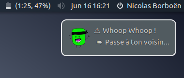

# t1m3r



## Dependencies
* libnotify
* mplayer

## Kick launch
`curl -L https://raw.githubusercontent.com/epfl-dojo/t1m3r/master/t1m3r.sh | zsh`

## Usage
By default, `./t1m3r.sh` will count down for 300s with a random sound at the end.

You can specify the duration and the sound URL, e.g.:
```
./t1m3r.sh 300 http://www.sound-fishing.net/SF-bruitages/alarme/SF-Alarmradar.mp3
```
